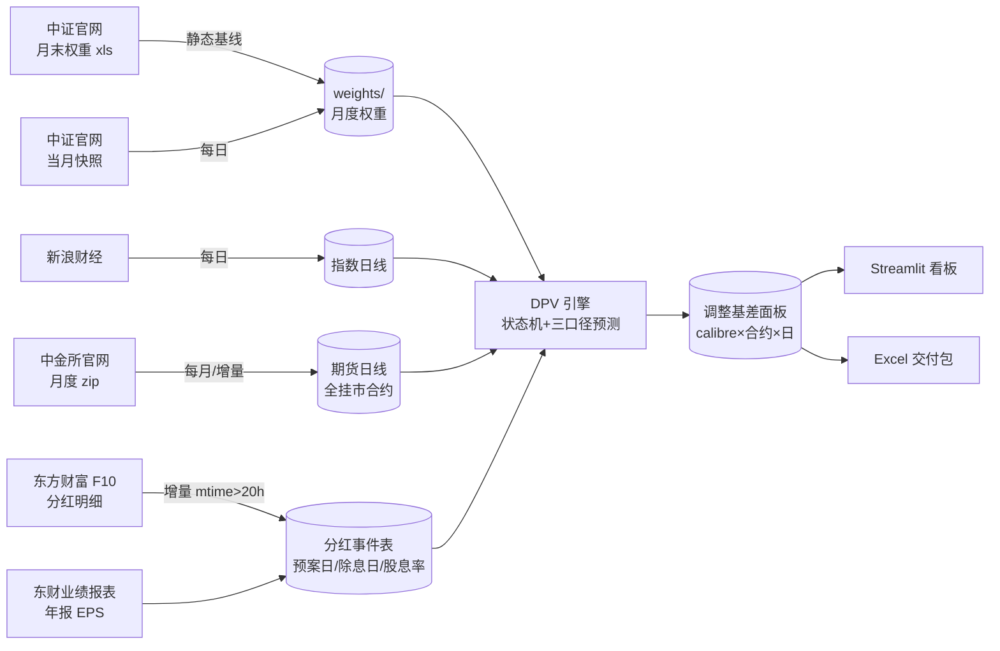
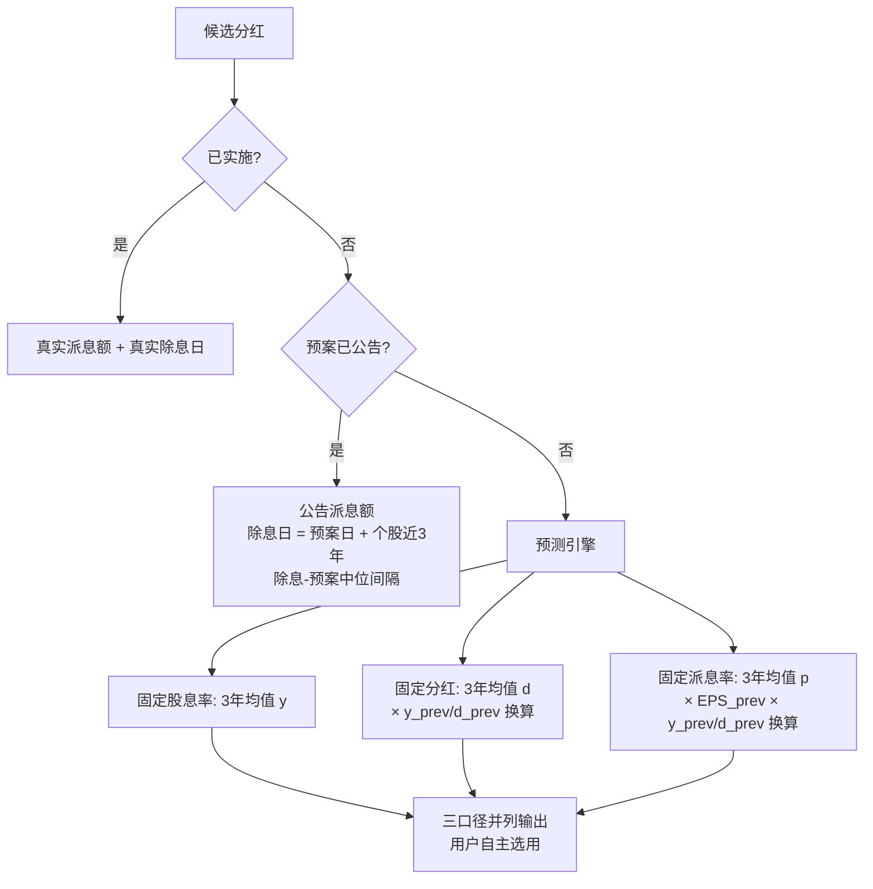

# 方法论：股指期货剔除分红基差

**口径版本**：V2（三口径并列 + 月度历史权重）　**范围**：IF/IH/IC/IM，日频，2015 年起（IM 自上市月 2022-07）

## 1. 定义

| 符号 | 含义 |
|---|---|
| S_t / F(t,T) | 现货指数 / 交割日 T 的期货合约在 t 日收盘 |
| w_i(t) | 成分股 i 在 t 时刻的权重（最近已发布月末历史权重） |
| y_i | 成分股 i 的股息率（每股现金分红 ÷ 股价） |
| DPV(t,T) | (t, T] 内预期除息的分红折算点数 |

$$
\text{贡献点数}_i = w_i(t)\times y_i \times S_t,\qquad
DPV(t,T)=\sum_{t<\,ex_i\,\le T} \text{贡献点数}_i
$$

$$
B=F-S_t,\qquad
\boxed{B_{adj}=B+DPV=F-(S_t-DPV)},\qquad
B_{adj}^{ann}=\frac{B_{adj}}{S_t}\cdot\frac{365}{T-t}
$$

方向推导（无套利，r=0）：t 日买现货+卖期货持有至交割，组合终值 = S_T + DPV − (S_T − F) = F + DPV；令其等于 S_t 得理论期货价 **F\* = S_t − DPV**（期货锚定除息后指数，天然低于现货一块分红），故真实情绪基差 = F − F\* = B + DPV。中证指数编制采用除数修正法：送股/转增/配股修正除数、点位不回落，仅现金除息使点位自然下降——DPV 仅计现金分红即为正确口径。

## 2. 数据流水线

全部为公开数据：中金所官网、中证指数公司、新浪财经、东方财富 F10、东财业绩报表。无任何授权数据源。

## 3. 分红金额判定状态机

- **信息集纪律（无前视）**：预测只用 预案公告日 < t 的记录；EPS 用法定披露时点（年报次年 4/30）已生效值；
- **清洗**：预估除息日 ≤ t 剔除、负值剔除、超额派息（分红 > 净利润）剔除、剔除清单留痕；
- **二次分红**：近三年存在第二笔分红的公司独立建模（除息日取下半年历史中位）；
- **排除**：EPS<0 不分红（历史占比 <7%）、上市不足一年无分红记录者计入不可预测盲区。

## 4. 权重口径

权重时间线 = 用户提供的中证官网月末文件（静态，每月一份，四指数 ×139 月全覆盖）。t 日使用 ≤t 最近月末文件；当月个股缺失记 w=0，**同时完成历史成分资格修正**。送转/配股经指数除数修正后对点位无影响，仅通过股本变化进入权重通道。

## 5. 样本外回测（2025 年，每月末视角 vs 最终实际分红）

| 品种 | 固定股息率 MAE（点） | 固定分红 MAE | 固定派息率 MAE |
|---|---|---|---|
| IF | 1.85 | **1.75** | 2.32 |
| IH | 1.46 | **1.32** | 1.73 |
| IC | **1.05** | 1.31 | 1.32 |
| IM | **0.69** | 1.31 | 0.74 |

- 误差集中于 5~8 月分红季（公司行为突变的双向噪声，±2~3 点），其余月份 ±0.3 以内；
- 无系统性方向偏差（高估占比 38.5%）；绝对量级对 4000 点指数 ≈ 2.5bp；
- 分月明细见 `output/backtest_2025_calibres.csv`。三种口径无单一赢家，并列输出由使用者按品种/用途选择。

## 6. 已知局限

1. 中证官网不提供历史权重公开下载接口之外的验证；月度权重文件为用户提供（Wind 导出），若某月缺失则回退当月快照并影响该月精度；
2. 公司分红行为的突变（停发/加码/政策切换）只能滞后捕捉——这是纯公开历史数据方法的物理边界；
3. 不含资金成本 r 项（完整持有成本 F\* = S·e^{rΔt} − DPV）、不含回购注销的除数影响；
4. 东财 F10 解析失败的科创板个股（约 1.7%）计入不可预测盲区。

## 7. 参考文献

- 信达证券《股指期货分红点位预测》（2022-01）：三口径 CV 思想（本管线改为三口径并列，不自动选择）
- 华泰证券金工《成分股分红对股指期货基差的影响》（2019-08）：分层状态机与清洗规则
- 华泰期货《股指分红预测及基差影响分析》（2024-06-03）：除息日决策树、二次分红专项
- 中金量化《如何预估股指分红对衍生品的影响？》（2022-06-25）：简化折算式
- 华泰期货《分红扰动与股指基差计算器》（2025-03-28）："市场贴水 ≠ 可实现贴水"分解框架
