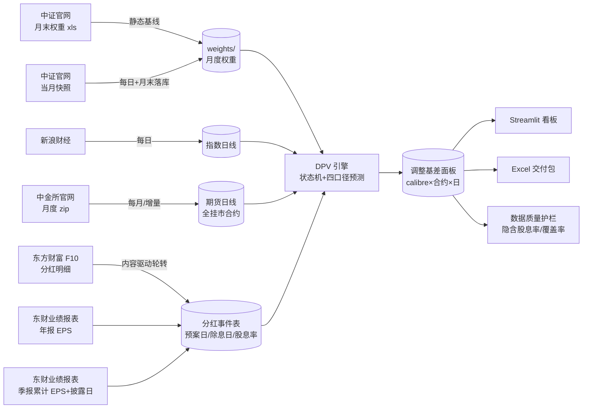
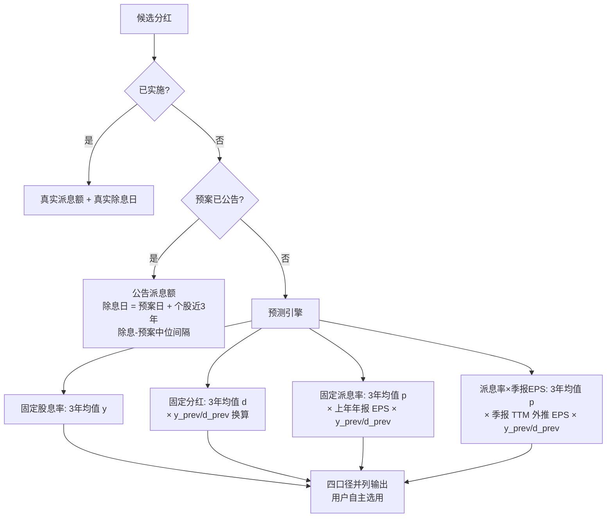

# 方法论：股指期货剔除分红基差

**口径版本**：V3（四口径并列 + 月度历史权重 + 数据质量护栏）　**范围**：IF/IH/IC/IM，日频，2015 年起（IM 自上市月 2022-07）

## 1. 定义

| 符号 | 含义 |
|---|---|
| S_t / F(t,T) | 现货指数 / 交割日 T 的期货合约在 t 日收盘 |
| w_i(t) | 成分股 i 在 t 时刻的权重（最近已发布月末历史权重） |
| y_i | 成分股 i 的股息率（每股现金分红 ÷ 股价） |
| DPV(t,T) | (t, T] 内预期除息的分红折算点数 |

$$
\text{贡献点数}_i = w_i(t)\times y_i \times S_t,\qquad
DPV(t,T)=\sum_{t<\,ex_i\,\le T} \text{贡献点数}_i
$$

$$
B=F-S_t,\qquad
\boxed{B_{adj}=B+DPV=F-(S_t-DPV)},\qquad
B_{adj}^{ann}=\frac{B_{adj}}{S_t}\cdot\frac{365}{T-t}
$$

方向推导（无套利，r=0）：t 日买现货+卖期货持有至交割，组合终值 = S_T + DPV − (S_T − F) = F + DPV；令其等于 S_t 得理论期货价 **F\* = S_t − DPV**（期货锚定除息后指数，天然低于现货一块分红），故真实情绪基差 = F − F\* = B + DPV。中证指数编制采用除数修正法：送股/转增/配股修正除数、点位不回落，仅现金除息使点位自然下降——DPV 仅计现金分红即为正确口径。

## 2. 数据流水线

全部为公开数据：中金所官网、中证指数公司、新浪财经、东方财富 F10、东财业绩报表。无任何授权数据源。

## 3. 分红金额判定状态机

- **信息集纪律（无前视）**：预测只用 预案公告日 < t 的记录；EPS 用法定披露时点（年报次年 4/30）已生效值；
- **清洗**：预估除息日 ≤ t 剔除、负值剔除、超额派息（分红 > 净利润）剔除、剔除清单留痕；
- **二次分红**：近三年存在第二笔分红的公司独立建模（除息日取下半年历史中位）；
- **排除**：EPS<0 不分红（历史占比 <7%）、上市不足一年无分红记录者计入不可预测盲区。

### 3.1 第四口径：派息率 × 季报外推 EPS（pq）

派息率口径的关键输入是「下一期分红所依据财年的 EPS」。原 p 口径用上一笔分红的年报 EPS（信息滞后约一年），pq 口径改为**季报 TTM 外推**：

| 截至 t 已披露 | EPS 估计 |
|---|---|
| 目标财年 Q1 | FY(上年) 全年 + Q1 累计 − 上年 Q1 累计 |
| 目标财年 H1 | FY(上年) 全年 + H1 累计 − 上年 H1 累计 |
| 目标财年 Q3 | FY(上年) 全年 + Q3 累计 − 上年 Q3 累计 |
| 目标财年年报 | 实际值 |
| 上年同期缺失 | 退化：本期累计 × 12 / 月数 |
| 目标财年尚无披露 | 最近可得报告期的 TTM run-rate |

目标财年 = 本事件所属财年 + 1（即下一期分红依据的财年）。TTM 优于朴素年化（`×4/×2/×4/3`）：后者假设季节性均匀，中国上市公司利润季度分布不均，朴素年化偏差可达 ±30%。

## 4. 数据质量护栏

每次流水线运行后执行 `scripts/check_data_quality.py`，产出 `output/data_quality_report.csv`：

| 检查 | 判据 | 告警含义 |
|---|---|---|
| 隐含股息率带内 | 中位数落在品种合理带（IF 0.6~5.0%、IH 0.8~6.0%、IC 0.4~4.0%、IM 0.2~3.5%） | 偏低 → 分红数据缺失；偏高 → 数据污染 |
| 高位越界 | 剩余期限 ≥120 天的行 p99 > 12% | 日期/金额异常 |
| 分红文件覆盖率 | 事件池中有分红文件的占比（仅提示） | 补抓未完成，历史 DPV 会低估 |
| 同比变动 | 相邻年度中位数变动 > 60%（仅提示） | 含窗口成分变化的自然波动 |

统计只用剩余期限 ≥55 天的合约（近月合约年化在分红季会自然放大）。覆盖率与同比变动作为**提示**而非告警——它们是补抓进度/窗口成分的自然反映，若升级为告警会造成告警疲劳；缺数据的后果由隐含股息率越界捕获。异常打印 GitHub Actions 注解，不阻断流水线。

## 4. 权重口径

权重时间线 = 用户提供的中证官网月末文件（静态，每月一份，四指数 ×139 月全覆盖）。t 日使用 ≤t 最近月末文件；当月个股缺失记 w=0，**同时完成历史成分资格修正**。送转/配股经指数除数修正后对点位无影响，仅通过股本变化进入权重通道。

## 5. 样本外回测（2025 年，每月末视角 vs 最终实际分红）

MAE 单位：指数点。

| 品种 | 固定股息率 | 固定分红 | 固定派息率 | 派息率×季报EPS |
|---|---|---|---|---|
| IF | 1.82 | **1.71** | 2.25 | 2.25 |
| IH | 1.66 | **1.50** | 1.94 | 1.94 |
| IC | **1.38** | 1.61 | 1.60 | 1.60 |
| IM | 1.08 | 1.52 | **1.01** | **1.01** |

- 误差集中于 5~8 月分红季（公司行为突变的双向噪声，±2~3 点），其余月份 ±0.3 以内；
- 无系统性方向偏差；绝对量级对 4000 点指数 ≈ 2.5bp；
- 分月明细见 `output/backtest_2025_calibres.csv`。四个口径无单一赢家（IC/IM 偏股息率与派息率，IF/IH 偏固定分红），并列输出由使用者按品种/用途选择。

## 6. 已知局限

1. 月度权重文件 140 期（2015-01 起），若某月缺失则回退当月快照并影响该月精度；月末文件在调样生效日（6/12 月第二个周五）后约两周才发布，该窗口内权重略滞后；
2. 公司分红行为的突变（停发/加码/政策切换）只能滞后捕捉——这是纯公开历史数据方法的物理边界；
3. 不含资金成本 r 项（完整持有成本 F\* = S·e^{rΔt} − DPV）、不含回购注销的除数影响；
4. **已退市股票分红无法从免费渠道获取**（实测东财 F10 对退市股返回空），2015-2016 年早期成分的分红存在低估；
5. 季报 EPS 用东财业绩报表「最新公告日期」作披露时点，极端情况下（补披露/更正公告）可能略有滞后；一致预期 EPS（分析师预测）为付费数据，未纳入。

## 7. 参考文献

- 信达证券《股指期货分红点位预测》（2022-01）：三口径 CV 思想（本管线改为三口径并列，不自动选择）
- 华泰证券金工《成分股分红对股指期货基差的影响》（2019-08）：分层状态机与清洗规则
- 华泰期货《股指分红预测及基差影响分析》（2024-06-03）：除息日决策树、二次分红专项
- 中金量化《如何预估股指分红对衍生品的影响？》（2022-06-25）：简化折算式
- 华泰期货《分红扰动与股指基差计算器》（2025-03-28）："市场贴水 ≠ 可实现贴水"分解框架
