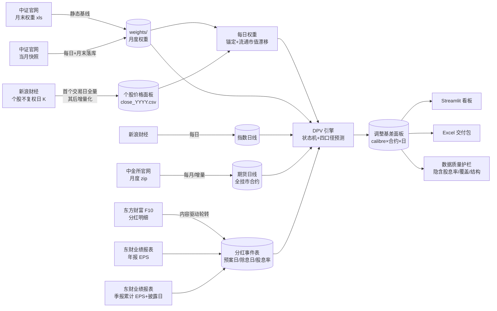
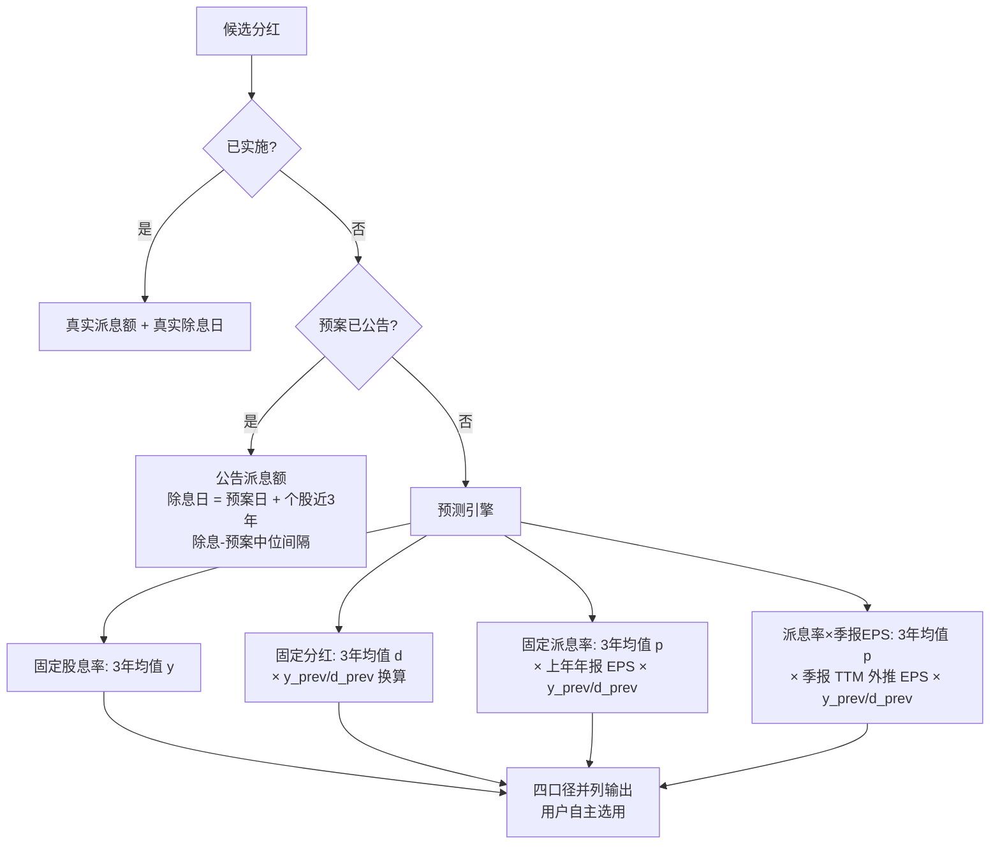
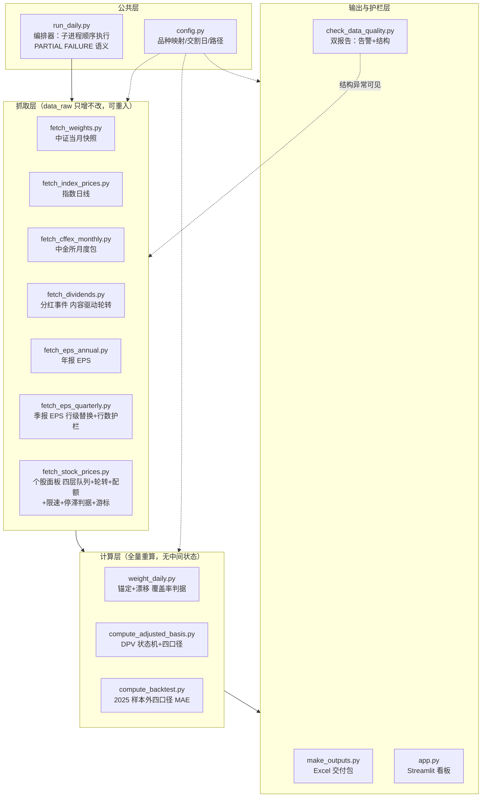

# 方法论：股指期货剔除分红基差

**口径版本**：V5.1（四口径并列 + 月末锚定/每日流通市值权重 + 权重覆盖率启用判据 + 数据质量护栏 + 抓取调度体系 + 系统技术设计 §8）　**范围**：IF/IH/IC/IM，日频，2015 年起（IM 自上市月 2022-07）

## 1. 定义

| 符号 | 含义 |
|---|---|
| S_t / F(t,T) | 现货指数 / 交割日 T 的期货合约在 t 日收盘 |
| w_i(t) | 成分股 i 在 t 时刻的权重（月末官方权重锚定 + 期内按流通市值漂移，见 §5） |
| y_i | 成分股 i 的股息率（每股现金分红 ÷ 股价） |
| DPV(t,T) | (t, T] 内预期除息的分红折算点数 |

$$
\text{贡献点数}_i = w_i(t)\times y_i \times S_t,\qquad
DPV(t,T)=\sum_{t<\,ex_i\,\le T} \text{贡献点数}_i
$$

$$
B=F-S_t,\qquad
\boxed{B_{adj}=B+DPV=F-(S_t-DPV)},\qquad
B_{adj}^{ann}=\frac{B_{adj}}{S_t}\cdot\frac{365}{T-t}
$$

方向推导（无套利，r=0）：t 日买现货+卖期货持有至交割，组合终值 = S_T + DPV − (S_T − F) = F + DPV；令其等于 S_t 得理论期货价 **F\* = S_t − DPV**（期货锚定除息后指数，天然低于现货一块分红），故真实情绪基差 = F − F\* = B + DPV。中证指数编制采用除数修正法：送股/转增/配股修正除数、点位不回落，仅现金除息使点位自然下降——DPV 仅计现金分红即为正确口径。

## 2. 数据流水线



全部为公开数据：中金所官网、中证指数公司、新浪财经、东方财富 F10、东财业绩报表。无任何授权数据源。

### 2.1 个股价格面板的获取与自愈

每日权重的输入是覆盖全部成分股的个股不复权日线，规模约 3.5k 只，免费接口不提供批量下载，只能逐只请求，因此**获取策略本身是精度的一部分**：

| 机制 | 做法 | 目的 |
|---|---|---|
| 全量回补 / 增量 | 按「无落库记录」补 `FULL_BARS=3000`（回溯至 2014），已有记录者只取 `TAIL_BARS=45` | 首次建立面板，其后仅追加 1 行/日 |
| 抓取顺序 | **四层优先**：**① 当前成分 × 当日缺价（增量 45 根）→ ② 当前成分 × 无落库记录（补 3000 根）→ ③ 当前成分 × 当日已有价（增量 45 根）→ ④ 历史成分 × 无落库记录（补 3000 根）**。参照日取自价格面板，但**要求该日有实质填充**（非空数 ≥ `PRICE_MIN_DAY_FILL`=0.5 × 近 20 行非空中位数），否则回退到更早的那一天 | 按「对当日产品的价值 / 抓取成本」排序：①最便宜（1 请求/只）且当日价格是看板硬需求；②决定每日权重覆盖率、且无记录必然也缺当日价；③自愈该股近期其他缺口，对权重覆盖率有直接帮助；④只影响历史回测（其权重多为 0），最后做。**早期版本把"全部当前成分"当成一个 45 根的大组（不分当日是否有价）**，在限流下光这一组就吃光预算，回补队列三轮一次都没轮到。参照日的填充门槛很关键：面板末行只要有个别股票先拿到新日期就会变成那一天，而数据源此时**还没有当日收盘价**（盘中尤甚），于是 ① 组膨胀到 1500+ 只且**抓不缩**（每只都返回成功、却都没有那一行），整轮预算被徒劳请求吃光 —— 2026-09-15 盘中连续两轮约 1000 次请求几乎零效果；把参照日改回有实质填充的 9-14 后，① 组从 **1521 只塌缩到 2 只** |
| **防饥饿：组内轮转 + 组间配额** | ① 组带游标 `output/price_cursor.json`（随提交入库），游标是**组内偏移**：本轮消费多少只偏移就前进多少（与消费条数精确对齐），整组做完则归零；同时 ① 组单轮最多做 `PRICE_GAP_MAX`(600) 只。②④ 两个回补组**不**带游标——抓成功即进入 `stored_codes`、下轮自动退出队列，天然收敛 | 单轮必然被限流/预算截断，**若每次都从固定队头开始，被截断的永远是同一批队尾代码**（见回归实测 1）。但只加轮转还不够：**若 ① 组自身规模就大于单轮产出，它每轮都会吃光预算、把后面各组饿死**（见回归实测 2），故必须同时给它封顶 |
| **时间预算（硬保护）** | `PRICE_BUDGET`：用尽即停止取新任务、落盘已完成部分，未轮到者记 `skipped`（不算失败），下次运行继续。脚本默认 3600s，本项目在 workflow 中设为 14400s（4 小时） | **必须在 job 上限前主动收尾**。2026-09-14 曾因退避遇上持续限流而跑满当时的 `timeout-minutes`(90) 被 GitHub cancel，远端零产出（连已抓数据都没提交）。GitHub-hosted runner 单 job 硬上限为 **6 小时**，与仓库可见性无关；本项目为 public 仓库、Actions 分钟数免费不限量，故上限设 5 小时，无需为省额度压缩时长 |
| 限流自适应 | 命中 `403/429/456/5xx` 或非 JSON → **全局指数退避**（15s→30→60→120→240→300s 封顶，成功即重置）；连续 20 个空响应同样判定为被限流 | 云端首次运行因突发限流导致深市整段失败，退避后自愈 |
| 收尾判据：**看产出，不看冷却占比** | 连续 `PRICE_STALL_LIMIT`(1800s) 没有任何成功抓取 → 收尾；或时间预算用尽。**不再使用"冷却占已用时长比例"**（旧 `COOLDOWN_DOMINANCE`=0.75 已移除） | 旧判据在持续限流下让每轮在约 50 分钟就中止 —— 2026-09-15 实测三次手动运行各 **52/52/57 分钟**，只用了 4 小时预算的 **22%**，单轮产出仅 583/572/440 只；而命中限流后的自动重试其实都能成功，只是慢，等于把剩余 3 小时白扔。用产出判据既拦得住真螺旋（确实零产出），又让限流下仍在推进的长任务跑满预算。冷却窗口内重复命中不叠加的机制保留 |
| 兜底限额 | 腾讯兜底每轮最多 200 次（`PRICE_TENCENT_MAX`） | 新浪被限流时失败代码会大量涌向兜底，把请求量放大 2~3 倍、让限流拖更久 |
| 速率压制 | 并发 4（`PRICE_WORKERS`）、每请求间隔 0.1s（`PRICE_DELAY`），**另加全进程令牌间隔 `PRICE_RATE`=1 req/s** | 新浪按突发窗口限流，突发速率只会换来最长 300s 的全局冷却（期间吞吐为 0）。压到 1 req/s 后 4 小时预算可发 14400 次请求，远超一轮全量所需（约 2638 次）—— **用长时间的低速换总产出，而不是短时间的高速**。`PRICE_RATE` 只是上限，实际速率还受到达速率约束 |
| 分批落盘 | 每 400 只写盘一次（`FLUSH_EVERY`）；截断 break 时**补收已完成的 future**（最多 WORKERS-1 个，其请求已发出、不收就白丢）；workflow 提交步骤带 `if: always()` | 中断/超时不丢已抓数据；pipeline 任何一步非零退出时，已成功环节的数据也照常提交（部分数据 > 零数据，缺口下轮自愈）——否则默认的 `success()` 条件会让一次脚本崩溃丢掉整轮产出 |
| 失败可见 | 逐代码记录原因到 `output/price_fetch_status_prices.csv` 并随提交入库 | 失败不再被静默丢弃（原先的 `data_raw/stock_prices/_failed.txt` 被 `.gitignore` 排除，云端不可见） |
| 天然自愈 | 无数据者**不落库**，下次运行仍在「无落库记录」集合中被重试 | 无需人工补抓，多轮运行逐步收敛 |

满负载下的量级参考：队列 2638 只 = ① 当日缺价 + ② 当前成分缺记录 236 + ③ 当日有价自愈 + ④ 历史成分缺记录 838。在 `PRICE_RATE`=1 req/s 的全局限速下，一轮全量的**下限**约 2638 秒（≈44 分钟）；限流宽松时可上调 `PRICE_RATE`。4 小时预算对一轮全量有充足余量，故不需要靠"跑得多快"取胜，只需保证**每轮都跑到底**。

> **为什么必须有队列轮转**（2026-09-14 的回归实测）：单轮必然被限流/预算截断，而队列若每次都从固定升序队头开始，被截断的永远是同一批队尾代码。当时**连续三次运行**的「价格面板覆盖」一直卡在 **2398/3472 只**分毫不动，当日（9-14）有价仅 **801/1564**；把「升序前 801 只」与实际拿到当日价的集合对比，重合度高达 **800/801（99.9%）**，缺价的 763 只几乎全部是 601/603/605/688 段。缺价代码在队列中的升序位次为 742~1563（中位 1182），**连续三轮零进展**，而排在其后的两个回补组则一次都没轮到。结论：限流不是唯一瓶颈，**「固定队头 + 必然截断」的组合本身就会制造永久饥饿**。

> **为什么还要给 ① 组封顶**（2026-09-15 的回归实测 2）：加了轮转之后又跑了三轮，① 组内部确实在轮转，但**整体产出仍然停滞** —— 价格面板覆盖继续卡在 2398/3472，IC/IM 权重覆盖率（87.9%/85.6%）与上一轮**逐位相同**，因为 ① 组当时有 1521 只、而单轮只消费 440~583 只，队首组永远做不完，②③④ 一轮都没轮到。而 ① 组之所以膨胀到 1521 只，是因为参照日被"个别股票先拿到的 9-15"顶到了数据源其实还没有的那一天（见上表"抓取顺序"行）。两条一起修：把参照日改回有实质填充的 9-14（① 组 1521→2 只），并给 ① 组加 `PRICE_GAP_MAX` 封顶。**教训：优先级排序只解决"先做什么"，不解决"能不能轮到"——若某组的规模大于单轮吞吐，它一定会饿死后面的组，必须同时设配额。**

覆盖率不可能达到 100%：**已退市股票无免费历史行情**（见局限 4/7）。故不追求全覆盖，而是把「未覆盖成分股的权重冻结在月末锚点」这一残余误差量化为**权重覆盖率**，并据此判定是否启用每日权重（§5）。

## 3. 分红金额判定状态机



- **信息集纪律（无前视）**：预测只用 预案公告日 < t 的记录；EPS 用法定披露时点（年报次年 4/30）已生效值；
- **清洗**：预估除息日 ≤ t 剔除、负值剔除、超额派息（分红 > 净利润）剔除、剔除清单留痕；
- **二次分红**：近三年存在第二笔分红的公司独立建模（除息日取下半年历史中位）；
- **排除**：EPS<0 不分红（历史占比 <7%）、上市不足一年无分红记录者计入不可预测盲区。

**未公告候选生成（2026-09-16 补齐，`add_prediction_candidates`）**：上表「未公告 → 预测引擎」分支要求事件池里**存在**未公告候选，但事件池原先只从已公告行构建 —— t 越接近数据末端，`ann > t` 的事件必然趋空，**当下时点的预测态为空集**：四口径在当下完全相同（口径差异只在预测态分化），且窗口内"将除息但尚未公告"的分红被整体漏算、DPV 低估 → basis_adj 高估（2026-08-31 中报披露截止后 `announced_ratio` 恒为 1.0 即此症；IF2703 的 DPV 被低估近一半）。补齐方式：对每只股票将其历史预估除息日各自做**周年外推**（+365k 天，k≤3），保留落在数据末端前 30 天至后 400 天窗内、与已有事件间隔 ≥60 天的候选（判重保证凡池里已有真实事件的空档不重复生成，历史面板因此几乎不变）；候选的四口径收益继承该股最新真实事件的预测值（基于其前三次历史均值，对当下无前视）；预估除息日 = 周年外推值，公告日 = 除息日 − 个股预案→除息中位间隔。效果：2026-09-15 的 IF2703 DPV 从 17.9 点（漏算态）恢复为 32.7~40.0 点（四口径互异），`announced_ratio` 回到 0.45~0.55 的真实水平；2024-09 ~ 2026-07 的历史互异比例与四口径 MAE 逐位不变（回测窗口不与候选相交）。

### 3.1 第四口径：派息率 × 季报外推 EPS（pq）

派息率口径的关键输入是「下一期分红所依据财年的 EPS」。原 p 口径用上一笔分红的年报 EPS（信息滞后约一年），pq 口径改为**季报 TTM 外推**：

| 截至 t 已披露 | EPS 估计 |
|---|---|
| 目标财年 Q1 | FY(上年) 全年 + Q1 累计 − 上年 Q1 累计 |
| 目标财年 H1 | FY(上年) 全年 + H1 累计 − 上年 H1 累计 |
| 目标财年 Q3 | FY(上年) 全年 + Q3 累计 − 上年 Q3 累计 |
| 目标财年年报 | 实际值 |
| 上年同期缺失 | 退化：本期累计 × 12 / 月数 |
| 目标财年尚无披露 | 最近可得报告期的 TTM run-rate |

目标财年 = 本事件所属财年 + 1（即下一期分红依据的财年），事件所属财年由**公告日**推导：A 股年报分红在次年 1-6 月公告（属上一财年），7-12 月公告的多为中期/特别分红（属当年）。TTM 优于朴素年化（`×4/×2/×4/3`）：后者假设季节性均匀，中国上市公司利润季度分布不均，朴素年化偏差可达 ±30%。

> **曾长期失效（2026-09-14 修复）**：该口径原先读取 events 中并不存在的 `report_year` 列，`KeyError` 被 `except Exception` 静默吞掉 → 目标财年恒为 `None` → 外推 EPS 恒为 NaN → `y_fix_pq` 恒等于 `y_fix_p`。即投入产出面上"四口径并列"，实则只有三口径，回测中 pq 与 p 的 MAE 完全相同（这正是当初可据以发现的线索）。修复后由公告日推导目标财年，并在 `eps_est_q` 列留存外推值供核查。教训：**异常处理不得吞掉编程错误**——本条与 §2.1 的"失败静默丢弃"是同一类问题。

## 4. 数据质量护栏

每次流水线运行后执行 `scripts/check_data_quality.py`，产出 `output/data_quality_report.csv`：

| 检查 | 判据 | 告警含义 |
|---|---|---|
| 隐含股息率带内 | 中位数落在品种合理带（IF 0.6~5.0%、IH 0.8~6.0%、IC 0.4~4.0%、IM 0.2~3.5%） | 偏低 → 分红数据缺失；偏高 → 数据污染 |
| 高位越界 | 剩余期限 ≥120 天的行 p99 > 12% | 日期/金额异常 |
| 分红文件覆盖率 | 事件池中有分红文件的占比（仅提示） | 补抓未完成，历史 DPV 会低估 |
| 同比变动 | 相邻年度中位数变动 > 60%（仅提示） | 含窗口成分变化的自然波动 |

统计只用剩余期限 ≥55 天的合约（近月合约年化在分红季会自然放大）。覆盖率与同比变动作为**提示**而非告警——它们是补抓进度/窗口成分的自然反映，若升级为告警会造成告警疲劳；缺数据的后果由隐含股息率越界捕获。异常打印 GitHub Actions 注解，不阻断流水线。

另有结构检查产出 `output/data_quality_structure.csv`：

- **月末权重文件完整性**：各指数权重文件的期数、行数不足成分数的期数及最大缺口（详见 §5.1）；
- **个股价格面板覆盖**：universe 中有价格数据的只数占比（仅作灾难性下限，默认 30%）；低于下限说明数据源整体失效；
- **最新交易日价格填充（当前成分）**：最新交易日有价的当前成分只数，与**前一交易日**对比（应基本持平，<90% 即告警）。只检查"面板里有没有这只票"是不够的：当日增量若被昂贵的全量回补饿死（9-14 实况），面板仍在、覆盖率仍好看，但最新一天只有少数代码有价 —— 当日权重会静默退化为 forward fill 的上一日价格。该检查正是为此类"静默部分更新"设的哨兵；
- **每日权重启用状态**（逐品种）：给出该品种的**权重覆盖率**（有价格数据的成分股权重 / 锚点总权重）与计数覆盖率、当前成分缺价的权重合计，并标注该品种实际采用的口径（每日权重 / 回退静态）。判据见 §5。

## 5. 权重口径：月末锚定 + 每日流通市值漂移

中证指数仅公开**月末**权重（`closeweight.xls` 的日期字段恒为月末，逐日访问其日期不变）。月内静态权重有三处失真：定期调整生效日到月末文件发布之间的窗口、除权/停牌期间、以及月内个股相对涨跌完全不被反映。

本管线把月末官方权重当**锚点**，期内用个股流通市值的相对变动把权重漂移到每日：

```
w_i(t) = w_i(A) · m_i(t)/m_i(A)  ⁄  Σ_j [ w_j(A) · m_j(t)/m_j(A) ]  ×  Σ_j w_j(A)
A = ≤t 最近的中证月末权重日
m_i(t) = raw_close_i(t) × Π_{送转除权日 ≤ t} ( 1 + 送转总比例/10 )
```

**为什么锚定而不是直接按流通市值重算**：中证权重 = Σ(自由流通市值 × 加权比例因子)，因子按分级靠档（≤15%→15%…100%）且仅在定期调整时更新。锚定后因子差异被锚点吸收，本管线只刻画**期内相对变动**，与官方权重在锚点处严格一致——精度显著高于纯自算，也不需要拟合因子。

**流通市值代理的处理规则**：

| 事项 | 处理 | 理由 |
|---|---|---|
| 送转（送股/转股） | 用分红表「送转总比例」做股本联动修正 | 股本 ×(1+比例/10)、不复权价同步除权，市值不变；不修正会误判该股权重腰斩 |
| 现金分红 | **不修正** | 派现是真实现金流出，流通市值与指数权重应同步下降 |
| 停牌 | 取 ≤t 最近可得价格（forward fill） | 停牌期间价格不动 |
| 无价格数据的成分股 | 漂移记 1.0，且**保留在归一化分母中** | 若剔除，剩余个股权重会被整体放大，反而引入系统性偏差 |
| 解禁/增发/配股 | 未纳入 | 占成分股 1~2%/月、量级小，且逐月被锚点重置（见局限） |
| 定期调整（6/12 月第二个周五生效日 → 月末） | 期内**仍沿用上月末的成分名单与权重**，名单切换在月末锚点一次性吸收 | 中证月末权重文件本身已含新名单，无需额外机制；但该窗口内调入/调出的个股权重未即时切换（见局限 1） |
| 锚点晚于交易日（t 早于最早权重文件） | 基准价取 t 当日 → 期内漂移为 0 | 严格无前视 |

数据源：新浪财经日 K（**不复权**，实测与腾讯 raw 逐日一致），腾讯为兜底。价格面板按年存为 `data_raw/stock_prices/close_YYYY.csv`（日期 × 代码宽表），每日仅追加一行，git 增量约 30KB/日。3.5k 只的逐只抓取策略、限流退避与自愈机制见 §2.1。

**启用判据（2026-09-14 修正）**：以**权重覆盖率**为主判据 —— 每个交易日「有价格数据的成分股权重 / 锚点总权重」的中位数需 ≥ `MIN_W_COV`（默认 90%），另设计数覆盖率灾难性下限 `MIN_PRICE_COV`（默认 30%，只用于拦截数据源彻底失效）；不满足则整体回退月末静态权重。

之所以不用「有价格的成分股**只数**占比」：该分母是全部历史成分，含大量已退市小票，会同时误判两个方向。实测反例（2026-09-13 云端运行，新浪限流导致深市 001/002/003/300/301 整段抓取失败）：IC 按只数覆盖 61%（过线）但按权重缺 **40.7/100** —— 结果是「启用了每日权重」却把 40% 的指数权重冻结在月末锚点，产出的是**半更新的伪每日权重**，比明确回退静态更糟（用户无法从输出判断处于哪种口径）。改判据后，`check_data_quality.py` 的 `output/data_quality_structure.csv` 会逐品种给出权重覆盖率与实际口径，可直接核查。

环境变量：`STATIC_WEIGHTS=1` 强制回退；`MIN_W_COV` / `MIN_PRICE_COV` 调阈值。

### 5.1 月末权重文件的整行缺失修复

实测用户提供的 Wind 导出中证月末权重文件有系统性缺陷：**139/141 期的行数比指数成分数少 1**（IF 300 行只导出 299 行），且代码按升序排列时**恒定丢掉代码最小的那只成分股**——IF 全期缺 `000001.SZ`（平安银行），IH/IC/IM 缺的是当期最小代码成分。缺失规模按 100 − Σ(文件权重) 精确可知：

| 指数 | 整行缺失期数 | 平均缺口（权重） | 最大缺口 |
|---|---|---|---|
| 沪深300 | 139/141 | 0.76 | 1.21 |
| 上证50 | 139/141 | 2.18 | 4.49 |
| 中证500 | 139/141 | 0.27 | 0.36 |
| 中证1000 | 116/141 | 0.08 | 0.12 |

`load_weight_timeline` 自动修复：①若能确定被省略的代码（在完整期出现、且所有缺行期都不出现，如 IF 的 000001）→ 原样补回并赋缺口权重；②否则按缺口把文件内权重归一到 100。第二条不是随意缩放：若缺失成分的股息率≈指数平均，归一化对 DPV 是**严格正确**的插补（`Σw·y + w_missing·ȳ = ȳ×100`），误差远小于整体遗漏——IH 2015 年遗漏 4.5% 权重会直接低估 DPV 约 4.7%。

## 6. 样本外回测（2025 年，每月末视角 vs 最终实际分红）

MAE 单位：指数点（2026-09-14 复算，含权重整行缺失修复后的权重）。

| 品种 | 固定股息率 | 固定分红 | 固定派息率 | 派息率×季报EPS | pq 生效比例 |
|---|---|---|---|---|---|
| IF | 1.827 | **1.721** | 2.267 | 2.864 | 53.9% |
| IH | 1.684 | **1.520** | 1.960 | 2.325 | 45.8% |
| IC | **1.710** | 1.828 | 1.863 | 2.654 | 47.4% |
| IM | **1.088** | 1.685 | 1.069 | 1.916 | 48.7% |

「pq 生效比例」= 目标财年季报可得的行占比；其余行因季报不可得而退化为上年年报 EPS（即等于 p 口径）。

- 误差集中于 5~8 月分红季（公司行为突变的双向噪声，±2~3 点），其余月份 ±0.3 以内；
- 无系统性方向偏差；绝对量级对 4000 点指数 ≈ 2.5bp；
- 分月明细见 `output/backtest_2025_calibres.csv`，汇总见 `output/backtest_calibres_MAE.csv`（四口径，每次运行重算）；
- **pq 口径在该样本期劣于其余三口径**（MAE 高 0.6~1.0 点）。这是 2026-09-14 修复其失效 bug 后首次得到的可信结果，此前 pq 恒等于 p、无法评估。解读：TTM 外推把**单季利润波动**放大进年度 EPS，而分红对应的年度利润更接近平滑值；有效样本（pq≠p，约半数行）又偏向利润波动大的公司。故 pq 暂列而不建议作为默认口径 —— 保留它的价值在于给出"利润口径"的上界参考，待 2026 样本外（现有 `eps_quarterly` 覆盖 2026 全部已披露期）再评估。

## 7. 已知局限

1. 月度权重文件 141 期（2015-01 起），若某月缺失则回退当月快照并影响该月精度；**定期调整（6/12 月第二个周五生效）的名单切换只在月末锚点处生效**——生效日到月末（约 2 周，每年合计约 1 个月）内仍沿用上月末的成分名单，调入/调出个股的权重未即时切换，误差方向与大小取决于新旧成分的股息率差与换手规模（未单独量化校正；理论上可用公开的调整公告名单在生效日切换，见 §5 表格说明）；**139/141 期的整行缺失已按 §5.1 修复**（IF 补回 000001 并赋缺口权重，其他指数按缺口归一），各期权重合计回到 100；
2. 公司分红行为的突变（停发/加码/政策切换）只能滞后捕捉——这是纯公开历史数据方法的物理边界；
3. 不含资金成本 r 项（完整持有成本 F\* = S·e^{rΔt} − DPV）、不含回购注销的除数影响；
4. **已退市股票分红/价格无法从免费渠道获取**（实测东财 F10 对退市股返回空、新浪无历史行情），2015-2016 年早期成分的分红与权重漂移存在低估；
5. 季报 EPS 用东财业绩报表「最新公告日期」作披露时点，极端情况下（补披露/更正公告）可能略有滞后；一致预期 EPS（分析师预测）为付费数据，未纳入；
6. 每日权重未纳入解禁/增发/配股造成的流通股本变动，也未使用中证「自由流通量」口径（用无限售流通市值近似，差异被锚点吸收）；
7. 个股日线取自新浪免费接口，**按突发窗口限流**（返回 403/429/456/5xx 或非 JSON、空响应），**已退市股票无法获取行情**（与局限 4 同源）。故权重覆盖率不可能达到 100%（早期年份尤甚）；未覆盖成分股的权重被冻结在月末锚点，引擎按权重覆盖率判定是否启用每日权重（§5），`output/data_quality_structure.csv` 逐品种记录实际口径。抓取的限流自适应、时间预算、四层队列优先与轮转自愈机制见 §2.1，失败清单写入 `output/price_fetch_status_prices.csv` 随提交入库以便核查。**注意**：覆盖率是逐轮收敛的——单轮受时间预算（本项目 4 小时，脚本默认 1 小时）、全进程限速（`PRICE_RATE`=1 req/s）与**产出停滞判据**约束，遇持续限流时该轮只完成队列前段（队列已按 §2.1 的四层优先排序，故优先保住的正是当日价格与当前成分），其余记 `skipped` 留待后续运行；「当日缺价」组带游标轮转、下一轮从截断处接着做而非重头再来，且该组单轮有配额上限（`PRICE_GAP_MAX`），确保后面的回补组不会被饿死；单次运行后若某品种权重覆盖率仍低于阈值，它当期输出的是静态口径而非有偏差的伪每日权重。
8. 季报 EPS（`data_raw/eps_quarterly.csv`，pq 口径的输入）覆盖 2015Q1 起的 46 期。其增量合并曾在一次运行中因「按报告期替换时误丢弃整个 DataFrame」而把 138k 行压成 6.5k 行（2026-09-14 发现并修复，历史已从版本库恢复）。现已加**行数护栏**：合并后行数比原有下降超 10% 即拒绝写盘并以非零退出码报错，避免静默数据丢失。

## 8. 系统技术设计

§2–§7 讲的是**方法**（算什么、为什么这么算），本节讲**工程**（用什么结构把它可靠地跑起来）。抓取调度的细节已单列于 §2.1，此处不重复。

### 8.1 模块架构



分层理由：**抓取层是增量、有状态的**（游标/失败清单/已落库记录），**计算层是无状态全量重算**（每次从 `data_raw` 原始表重建全部输出）。这个不对称是刻意设计：任何计算 bug 修复后下一轮自动重算生效，无需 migration；抓取层的进度则持久化在数据本身（"抓没抓过"看表头）与极少数状态文件里，两层的可靠性策略互不干扰。

### 8.2 每日运行时序（run_daily 的执行顺序及依赖原因）

| 步骤 | 脚本 | 依赖谁 | 为什么排这里 |
|---|---|---|---|
| 1 | fetch_weights | 中证官网 | 当月快照兜底：权重文件是后面每日权重的锚点 |
| 2 | fetch_index_prices | 新浪 | 指数日线是 DPV 折算的基数 |
| 3 | fetch_cffex_monthly | 中金所 | 期货日线（月度 zip，补当前月+上一月） |
| 4 | fetch_dividends | 东财 F10 | 分红事件表是 DPV 引擎的核心输入 |
| 5a/5b | fetch_eps_annual / fetch_eps_quarterly | 东财业绩报表 | p/pq 口径的 EPS；季报表有行数护栏，崩了必须当场暴露 |
| 5c | fetch_stock_prices | 新浪（腾讯兜底） | **最贵的一步**（约 3.5k 只逐只请求），受 §2.1 全套调度保护，排在 EPS 之后以避免其失败挤占前面数据 |
| 6 | compute_adjusted_basis → compute_backtest → make_outputs | 上游全部 | 全量重算 |
| 7 | check_data_quality | 输出产物 | 体检不阻断；任何上游非零退出 → `PARTIAL FAILURE`，但**提交步骤 `if: always()` 仍落盘已成功环节的数据**（部分数据 > 零数据，缺口下轮自愈） |

### 8.3 状态与持久化：git 即数据库

没有数据库、没有对象存储，**版本库本身就是唯一的状态载体**。每次运行 = 一笔数据提交，回滚/审计/跨机同步天然免费：

| 状态 | 载体 | 设计要点 |
|---|---|---|
| 个股价格面板 | `data_raw/stock_prices/close_YYYY.csv`（日期 × 代码宽表，按年分文件） | 宽表让"某代码抓过没有"成为一次表头读取（`nrows=0`），**这是 ②④ 回补组天然收敛的机制**；每日仅追加一行，git 增量约 30KB/日；按年分文件避免单文件无限膨胀 |
| 抓取进度（①组） | `output/price_cursor.json` | 游标随数据入库 —— 云端连续运行之间唯一的显式状态文件 |
| 抓取失败清单 | `output/price_fetch_status_prices.csv` | 逐代码原因入库，"全成功时清空上轮清单"避免陈旧记录误导 |
| 分红事件表 | `data_raw/dividends/<code>.csv` | 逐股一文件；内容驱动轮转（活跃股 2 天/沉睡股 10 天一刷），不依赖 mtime（checkout 会重置 mtime，曾致刷新逻辑失效） |
| 季报 EPS | `data_raw/eps_quarterly.csv` | 行级替换合并 + 行数护栏（降幅 >10% 拒绝写盘并 FATAL） |
| 月末权重 | `data_raw/weights/<index>_YYYYMMDD.csv` | 每月末快照落库，保证历史 point-in-time 完整 |
| 结构体检报告 | `output/data_quality_structure.csv` | 含权重覆盖率、当日填充、游标位置等**哨兵行** |

选 CSV 宽表而非 parquet/sqlite 的理由：runner 环境零服务依赖、diff 可读可审计、pandas 直读；代价（逐值字符串存储）在本规模下（约 3.5k 列 × 250 行/年）可忽略。

### 8.4 可靠性设计模式（六条，全部由真实事故固化）

| # | 原则 | 一句话表述 | 固化自 |
|---|---|---|---|
| 1 | **fail-visible** | 异常处理不得吞编程错误：`except Exception` 只用于"预期内的数据缺失"，KeyError/解包错误必须炸出来 | pq 口径 `report_year` KeyError 被吞 → `pq ≡ p` 三个月无察觉（§3.1）；抓取失败被 `elif rows:` 静默丢弃 |
| 2 | **部分数据 > 零数据** | 中断时保已完成的：分批落盘 + 截断补收 future + 提交步骤 `if: always()`；无数据者不落库、下轮重试（天然自愈） | 2026-09-14 被 cancel 时"整轮零产出"——pipeline 任何一步非零退出都会让已抓数据不提交 |
| 3 | **队列调度三定律** | 优先级决定"先做什么"，**轮转**决定"从哪里开始"，**配额**决定"能不能轮到"——三者缺一即饥饿 | 固定队头+必然截断 → 队尾连续三轮零进展（§2.1 回归实测 1）；①组 1521 只 > 单轮吞吐 → ②④ 永远轮不到（回归实测 2） |
| 4 | **判据看产出，不看投入** | 收尾判据是"连续 1800s 零成功抓取"，而非"等待时间占比"——慢 ≠ 无进展 | 冷却占比 0.75 让每轮只用掉 22% 预算就收尾，白扔 3 小时（§2.1） |
| 5 | **数据护栏前置** | 坏数据在写入前拦截：行数护栏、参照日填充门槛（≥0.5×近 20 日中位数）、权重覆盖率启用判据（90%） | 季报历史被压 95%；参照日被半填充日顶走 → ①组 1521 只抓不缩；IC 权重缺 40/100 仍"过线"启用伪每日权重（§5） |
| 6 | **point-in-time 无前视** | 任何 t 日的计算只允许使用 t 日已公开的信息：预测用"预案日 < t"记录、EPS 用法定披露时点生效值、历史权重用当期月末文件、锚点晚于交易日则漂移记 0 | 方法论全体（§3 信息集纪律、§5 表格） |

这六条互为支撑：1 保证问题被看见，2/3 保证单轮产出最大化，4 保证资源不被误杀，5 保证坏数据不进库，6 保证产出可信。**每条都对应一次"任务显示 success 但产出错误"的事故**——经验是：在这个纯免费数据源 + 免费 runner 的架构里，可靠性问题几乎从不表现为崩溃，而是表现为"安静的成功"。

### 8.5 部署形态

| 项 | 配置 | 说明 |
|---|---|---|
| 定时跑批 | GitHub Actions，cron 北京时间 00:30（UTC 16:30） | 实际启动常有 2~6 小时排队延迟（免费 runner），属常态 |
| 手动触发 | `workflow_dispatch` | 补数/验证用；**盘中触发对"当日价"无意义**（数据源收盘后才更新） |
| 资源上限 | `timeout-minutes: 300`；抓取预算 `PRICE_BUDGET=14400s` | 单 job 硬上限 6 小时（与仓库可见性无关）；public 仓库 Actions 分钟免费 |
| 看板 | Streamlit Community Cloud，读库内 `output/` 产物 | 看板零计算逻辑，只做呈现与口径说明 |

## 9. 参考文献

- 信达证券《股指期货分红点位预测》（2022-01）：三口径 CV 思想（本管线改为三口径并列，不自动选择）
- 华泰证券金工《成分股分红对股指期货基差的影响》（2019-08）：分层状态机与清洗规则
- 华泰期货《股指分红预测及基差影响分析》（2024-06-03）：除息日决策树、二次分红专项
- 中金量化《如何预估股指分红对衍生品的影响？》（2022-06-25）：简化折算式
- 华泰期货《分红扰动与股指基差计算器》（2025-03-28）："市场贴水 ≠ 可实现贴水"分解框架
