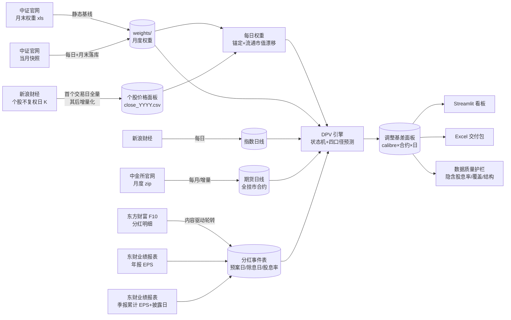
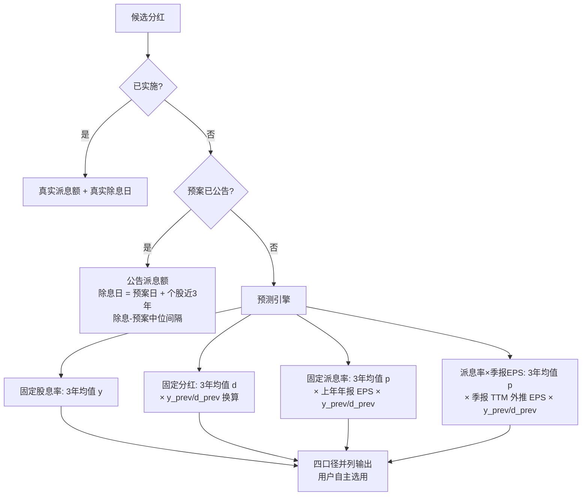

# 方法论：股指期货剔除分红基差

**口径版本**：V5（四口径并列 + 月末锚定/每日流通市值权重 + 权重覆盖率启用判据 + 数据质量护栏）　**范围**：IF/IH/IC/IM，日频，2015 年起（IM 自上市月 2022-07）

## 1. 定义

| 符号 | 含义 |
|---|---|
| S_t / F(t,T) | 现货指数 / 交割日 T 的期货合约在 t 日收盘 |
| w_i(t) | 成分股 i 在 t 时刻的权重（月末官方权重锚定 + 期内按流通市值漂移，见 §5） |
| y_i | 成分股 i 的股息率（每股现金分红 ÷ 股价） |
| DPV(t,T) | (t, T] 内预期除息的分红折算点数 |

$$
\text{贡献点数}_i = w_i(t)\times y_i \times S_t,\qquad
DPV(t,T)=\sum_{t<\,ex_i\,\le T} \text{贡献点数}_i
$$

$$
B=F-S_t,\qquad
\boxed{B_{adj}=B+DPV=F-(S_t-DPV)},\qquad
B_{adj}^{ann}=\frac{B_{adj}}{S_t}\cdot\frac{365}{T-t}
$$

方向推导（无套利，r=0）：t 日买现货+卖期货持有至交割，组合终值 = S_T + DPV − (S_T − F) = F + DPV；令其等于 S_t 得理论期货价 **F\* = S_t − DPV**（期货锚定除息后指数，天然低于现货一块分红），故真实情绪基差 = F − F\* = B + DPV。中证指数编制采用除数修正法：送股/转增/配股修正除数、点位不回落，仅现金除息使点位自然下降——DPV 仅计现金分红即为正确口径。

## 2. 数据流水线



全部为公开数据：中金所官网、中证指数公司、新浪财经、东方财富 F10、东财业绩报表。无任何授权数据源。

### 2.1 个股价格面板的获取与自愈

每日权重的输入是覆盖全部成分股的个股不复权日线，规模约 3.5k 只，免费接口不提供批量下载，只能逐只请求，因此**获取策略本身是精度的一部分**：

| 机制 | 做法 | 目的 |
|---|---|---|
| 全量回补 / 增量 | 按「无落库记录」补 `FULL_BARS=3000`（回溯至 2014），已有记录者只取 `TAIL_BARS=45` | 首次建立面板，其后仅追加 1 行/日 |
| 抓取顺序 | **四层优先**：**① 当前成分 × 当日缺价（增量 45 根）→ ② 当前成分 × 无落库记录（补 3000 根）→ ③ 当前成分 × 当日已有价（增量 45 根）→ ④ 历史成分 × 无落库记录（补 3000 根）**。参照日取自价格面板自身的最后一行（而非外部日历），数据源当日尚未更新时判定只退化为"全部缺价"，不会出错 | 按「对当日产品的价值 / 抓取成本」排序：①最便宜（1 请求/只）且当日价格是看板硬需求；②决定每日权重覆盖率、且无记录必然也缺当日价；③自愈该股近期其他缺口，对权重覆盖率有直接帮助；④只影响历史回测（其权重多为 0），最后做。**早期版本把"全部当前成分"当成一个 45 根的大组（不分当日是否有价）**，在限流下光这一组就吃光预算，回补队列三轮一次都没轮到 |
| **队列轮转（防饥饿）** | 当日增量组带游标 `output/price_cursor.json`（随提交入库）：下一轮从上一轮的截断位置接着做（对组长取模）。两个回补组**不**带游标——抓成功即进入 `stored_codes`、下轮自动退出队列，天然收敛。游标只按本轮实际取用数前进，整组做完则归零 | 单轮运行必然在限流/预算处被截断，**若队列每次都从固定队头开始，被截断的永远是同一批队尾代码**（见下方回归实测） |
| **时间预算（硬保护）** | `PRICE_BUDGET`：用尽即停止取新任务、落盘已完成部分，未轮到者记 `skipped`（不算失败），下次运行继续。脚本默认 3600s，本项目在 workflow 中设为 14400s（4 小时） | **必须在 job 上限前主动收尾**。2026-09-14 曾因退避遇上持续限流而跑满当时的 `timeout-minutes`(90) 被 GitHub cancel，远端零产出（连已抓数据都没提交）。GitHub-hosted runner 单 job 硬上限为 **6 小时**，与仓库可见性无关；本项目为 public 仓库、Actions 分钟数免费不限量，故上限设 5 小时，无需为省额度压缩时长 |
| 限流自适应 | 命中 `403/429/456/5xx` 或非 JSON → **全局指数退避**（15s→30→60→120→240→300s 封顶，成功即重置）；连续 20 个空响应同样判定为被限流 | 云端首次运行因突发限流导致深市整段失败，退避后自愈 |
| 冷却去螺旋 | **冷却窗口内的重复命中不叠加**（4 个线程会同时撞上限流，若各自计数则一次跳 4 档），且**只有"冷却主导本轮"才收尾**：`cooled ≥ PRICE_COOLDOWN_DOMINANCE(0.75) × 已用时长` 且累计 ≥ `PRICE_COOLDOWN_TOTAL=900s` | 既防止"每 5 分钟只放行几个请求"的死螺旋，又不误杀**限流下仍在稳定推进的长任务**。判据必须用占比而非冷却秒数的绝对值：9-14 的首次回补就因为"冷却累计到 900s 就收尾"而在 446/2922 只处中止，而当时冷却仅占已用时长的一小部分。占比门槛从 0.6 放宽到 0.75 是为了配合队列轮转——单轮产出越多，全覆盖所需轮数越少 |
| 兜底限额 | 腾讯兜底每轮最多 200 次（`PRICE_TENCENT_MAX`） | 新浪被限流时失败代码会大量涌向兜底，把请求量放大 2~3 倍、让限流拖更久 |
| 速率压制 | 并发 4（`PRICE_WORKERS`）、每请求间隔 0.1s（`PRICE_DELAY`） | 低于触发限流的突发速率 |
| 分批落盘 | 每 400 只写盘一次（`FLUSH_EVERY`） | 中断/超时不丢已抓数据 |
| 失败可见 | 逐代码记录原因到 `output/price_fetch_status_prices.csv` 并随提交入库 | 失败不再被静默丢弃（原先的 `data_raw/stock_prices/_failed.txt` 被 `.gitignore` 排除，云端不可见） |
| 天然自愈 | 无数据者**不落库**，下次运行仍在「无落库记录」集合中被重试 | 无需人工补抓，多轮运行逐步收敛 |

满负载下的量级参考（2026-09-15 实测队列结构，按修复后的顺序）：当日缺价 763 只 ≈ **3 分钟**；当前成分缺记录 236 只 ≈ 2 分钟；当日有价自愈 801 只 ≈ 3 分钟；历史成分缺记录 838 只 ≈ 6 分钟 —— 合计 2638 只，**无限流时一轮约 13 分钟**。

> **为什么必须有队列轮转**（2026-09-14 的回归实测）：单轮必然被限流/预算截断，而队列若每次都从固定升序队头开始，被截断的永远是同一批队尾代码。当时**连续三次运行**的「价格面板覆盖」一直卡在 **2398/3472 只**分毫不动，当日（9-14）有价仅 **801/1564**；把「升序前 801 只」与实际拿到当日价的集合对比，重合度高达 **800/801（99.9%）**，缺价的 763 只几乎全部是 601/603/605/688 段。缺价代码在队列中的升序位次为 742~1563（中位 1182），**连续三轮零进展**，而排在其后的两个回补组则一次都没轮到。结论：限流不是唯一瓶颈，**「固定队头 + 必然截断」的组合本身就会制造永久饥饿**。

覆盖率不可能达到 100%：**已退市股票无免费历史行情**（见局限 4/7）。故不追求全覆盖，而是把「未覆盖成分股的权重冻结在月末锚点」这一残余误差量化为**权重覆盖率**，并据此判定是否启用每日权重（§5）。

## 3. 分红金额判定状态机



- **信息集纪律（无前视）**：预测只用 预案公告日 < t 的记录；EPS 用法定披露时点（年报次年 4/30）已生效值；
- **清洗**：预估除息日 ≤ t 剔除、负值剔除、超额派息（分红 > 净利润）剔除、剔除清单留痕；
- **二次分红**：近三年存在第二笔分红的公司独立建模（除息日取下半年历史中位）；
- **排除**：EPS<0 不分红（历史占比 <7%）、上市不足一年无分红记录者计入不可预测盲区。

### 3.1 第四口径：派息率 × 季报外推 EPS（pq）

派息率口径的关键输入是「下一期分红所依据财年的 EPS」。原 p 口径用上一笔分红的年报 EPS（信息滞后约一年），pq 口径改为**季报 TTM 外推**：

| 截至 t 已披露 | EPS 估计 |
|---|---|
| 目标财年 Q1 | FY(上年) 全年 + Q1 累计 − 上年 Q1 累计 |
| 目标财年 H1 | FY(上年) 全年 + H1 累计 − 上年 H1 累计 |
| 目标财年 Q3 | FY(上年) 全年 + Q3 累计 − 上年 Q3 累计 |
| 目标财年年报 | 实际值 |
| 上年同期缺失 | 退化：本期累计 × 12 / 月数 |
| 目标财年尚无披露 | 最近可得报告期的 TTM run-rate |

目标财年 = 本事件所属财年 + 1（即下一期分红依据的财年），事件所属财年由**公告日**推导：A 股年报分红在次年 1-6 月公告（属上一财年），7-12 月公告的多为中期/特别分红（属当年）。TTM 优于朴素年化（`×4/×2/×4/3`）：后者假设季节性均匀，中国上市公司利润季度分布不均，朴素年化偏差可达 ±30%。

> **曾长期失效（2026-09-14 修复）**：该口径原先读取 events 中并不存在的 `report_year` 列，`KeyError` 被 `except Exception` 静默吞掉 → 目标财年恒为 `None` → 外推 EPS 恒为 NaN → `y_fix_pq` 恒等于 `y_fix_p`。即投入产出面上"四口径并列"，实则只有三口径，回测中 pq 与 p 的 MAE 完全相同（这正是当初可据以发现的线索）。修复后由公告日推导目标财年，并在 `eps_est_q` 列留存外推值供核查。教训：**异常处理不得吞掉编程错误**——本条与 §2.1 的"失败静默丢弃"是同一类问题。

## 4. 数据质量护栏

每次流水线运行后执行 `scripts/check_data_quality.py`，产出 `output/data_quality_report.csv`：

| 检查 | 判据 | 告警含义 |
|---|---|---|
| 隐含股息率带内 | 中位数落在品种合理带（IF 0.6~5.0%、IH 0.8~6.0%、IC 0.4~4.0%、IM 0.2~3.5%） | 偏低 → 分红数据缺失；偏高 → 数据污染 |
| 高位越界 | 剩余期限 ≥120 天的行 p99 > 12% | 日期/金额异常 |
| 分红文件覆盖率 | 事件池中有分红文件的占比（仅提示） | 补抓未完成，历史 DPV 会低估 |
| 同比变动 | 相邻年度中位数变动 > 60%（仅提示） | 含窗口成分变化的自然波动 |

统计只用剩余期限 ≥55 天的合约（近月合约年化在分红季会自然放大）。覆盖率与同比变动作为**提示**而非告警——它们是补抓进度/窗口成分的自然反映，若升级为告警会造成告警疲劳；缺数据的后果由隐含股息率越界捕获。异常打印 GitHub Actions 注解，不阻断流水线。

另有结构检查产出 `output/data_quality_structure.csv`：

- **月末权重文件完整性**：各指数权重文件的期数、行数不足成分数的期数及最大缺口（详见 §5.1）；
- **个股价格面板覆盖**：universe 中有价格数据的只数占比（仅作灾难性下限，默认 30%）；低于下限说明数据源整体失效；
- **最新交易日价格填充（当前成分）**：最新交易日有价的当前成分只数，与**前一交易日**对比（应基本持平，<90% 即告警）。只检查"面板里有没有这只票"是不够的：当日增量若被昂贵的全量回补饿死（9-14 实况），面板仍在、覆盖率仍好看，但最新一天只有少数代码有价 —— 当日权重会静默退化为 forward fill 的上一日价格。该检查正是为此类"静默部分更新"设的哨兵；
- **每日权重启用状态**（逐品种）：给出该品种的**权重覆盖率**（有价格数据的成分股权重 / 锚点总权重）与计数覆盖率、当前成分缺价的权重合计，并标注该品种实际采用的口径（每日权重 / 回退静态）。判据见 §5。

## 5. 权重口径：月末锚定 + 每日流通市值漂移

中证指数仅公开**月末**权重（`closeweight.xls` 的日期字段恒为月末，逐日访问其日期不变）。月内静态权重有三处失真：定期调整生效日到月末文件发布之间的窗口、除权/停牌期间、以及月内个股相对涨跌完全不被反映。

本管线把月末官方权重当**锚点**，期内用个股流通市值的相对变动把权重漂移到每日：

```
w_i(t) = w_i(A) · m_i(t)/m_i(A)  ⁄  Σ_j [ w_j(A) · m_j(t)/m_j(A) ]  ×  Σ_j w_j(A)
A = ≤t 最近的中证月末权重日
m_i(t) = raw_close_i(t) × Π_{送转除权日 ≤ t} ( 1 + 送转总比例/10 )
```

**为什么锚定而不是直接按流通市值重算**：中证权重 = Σ(自由流通市值 × 加权比例因子)，因子按分级靠档（≤15%→15%…100%）且仅在定期调整时更新。锚定后因子差异被锚点吸收，本管线只刻画**期内相对变动**，与官方权重在锚点处严格一致——精度显著高于纯自算，也不需要拟合因子。

**流通市值代理的处理规则**：

| 事项 | 处理 | 理由 |
|---|---|---|
| 送转（送股/转股） | 用分红表「送转总比例」做股本联动修正 | 股本 ×(1+比例/10)、不复权价同步除权，市值不变；不修正会误判该股权重腰斩 |
| 现金分红 | **不修正** | 派现是真实现金流出，流通市值与指数权重应同步下降 |
| 停牌 | 取 ≤t 最近可得价格（forward fill） | 停牌期间价格不动 |
| 无价格数据的成分股 | 漂移记 1.0，且**保留在归一化分母中** | 若剔除，剩余个股权重会被整体放大，反而引入系统性偏差 |
| 解禁/增发/配股 | 未纳入 | 占成分股 1~2%/月、量级小，且逐月被锚点重置（见局限） |
| 定期调整（6/12 月第二个周五生效日 → 月末） | 期内**仍沿用上月末的成分名单与权重**，名单切换在月末锚点一次性吸收 | 中证月末权重文件本身已含新名单，无需额外机制；但该窗口内调入/调出的个股权重未即时切换（见局限 1） |
| 锚点晚于交易日（t 早于最早权重文件） | 基准价取 t 当日 → 期内漂移为 0 | 严格无前视 |

数据源：新浪财经日 K（**不复权**，实测与腾讯 raw 逐日一致），腾讯为兜底。价格面板按年存为 `data_raw/stock_prices/close_YYYY.csv`（日期 × 代码宽表），每日仅追加一行，git 增量约 30KB/日。3.5k 只的逐只抓取策略、限流退避与自愈机制见 §2.1。

**启用判据（2026-09-14 修正）**：以**权重覆盖率**为主判据 —— 每个交易日「有价格数据的成分股权重 / 锚点总权重」的中位数需 ≥ `MIN_W_COV`（默认 90%），另设计数覆盖率灾难性下限 `MIN_PRICE_COV`（默认 30%，只用于拦截数据源彻底失效）；不满足则整体回退月末静态权重。

之所以不用「有价格的成分股**只数**占比」：该分母是全部历史成分，含大量已退市小票，会同时误判两个方向。实测反例（2026-09-13 云端运行，新浪限流导致深市 001/002/003/300/301 整段抓取失败）：IC 按只数覆盖 61%（过线）但按权重缺 **40.7/100** —— 结果是「启用了每日权重」却把 40% 的指数权重冻结在月末锚点，产出的是**半更新的伪每日权重**，比明确回退静态更糟（用户无法从输出判断处于哪种口径）。改判据后，`check_data_quality.py` 的 `output/data_quality_structure.csv` 会逐品种给出权重覆盖率与实际口径，可直接核查。

环境变量：`STATIC_WEIGHTS=1` 强制回退；`MIN_W_COV` / `MIN_PRICE_COV` 调阈值。

### 5.1 月末权重文件的整行缺失修复

实测用户提供的 Wind 导出中证月末权重文件有系统性缺陷：**139/141 期的行数比指数成分数少 1**（IF 300 行只导出 299 行），且代码按升序排列时**恒定丢掉代码最小的那只成分股**——IF 全期缺 `000001.SZ`（平安银行），IH/IC/IM 缺的是当期最小代码成分。缺失规模按 100 − Σ(文件权重) 精确可知：

| 指数 | 整行缺失期数 | 平均缺口（权重） | 最大缺口 |
|---|---|---|---|
| 沪深300 | 139/141 | 0.76 | 1.21 |
| 上证50 | 139/141 | 2.18 | 4.49 |
| 中证500 | 139/141 | 0.27 | 0.36 |
| 中证1000 | 116/141 | 0.08 | 0.12 |

`load_weight_timeline` 自动修复：①若能确定被省略的代码（在完整期出现、且所有缺行期都不出现，如 IF 的 000001）→ 原样补回并赋缺口权重；②否则按缺口把文件内权重归一到 100。第二条不是随意缩放：若缺失成分的股息率≈指数平均，归一化对 DPV 是**严格正确**的插补（`Σw·y + w_missing·ȳ = ȳ×100`），误差远小于整体遗漏——IH 2015 年遗漏 4.5% 权重会直接低估 DPV 约 4.7%。

## 6. 样本外回测（2025 年，每月末视角 vs 最终实际分红）

MAE 单位：指数点（2026-09-14 复算，含权重整行缺失修复后的权重）。

| 品种 | 固定股息率 | 固定分红 | 固定派息率 | 派息率×季报EPS | pq 生效比例 |
|---|---|---|---|---|---|
| IF | 1.827 | **1.721** | 2.267 | 2.864 | 53.9% |
| IH | 1.684 | **1.520** | 1.960 | 2.325 | 45.8% |
| IC | **1.710** | 1.828 | 1.863 | 2.654 | 47.4% |
| IM | **1.088** | 1.685 | 1.069 | 1.916 | 48.7% |

「pq 生效比例」= 目标财年季报可得的行占比；其余行因季报不可得而退化为上年年报 EPS（即等于 p 口径）。

- 误差集中于 5~8 月分红季（公司行为突变的双向噪声，±2~3 点），其余月份 ±0.3 以内；
- 无系统性方向偏差；绝对量级对 4000 点指数 ≈ 2.5bp；
- 分月明细见 `output/backtest_2025_calibres.csv`，汇总见 `output/backtest_calibres_MAE.csv`（四口径，每次运行重算）；
- **pq 口径在该样本期劣于其余三口径**（MAE 高 0.6~1.0 点）。这是 2026-09-14 修复其失效 bug 后首次得到的可信结果，此前 pq 恒等于 p、无法评估。解读：TTM 外推把**单季利润波动**放大进年度 EPS，而分红对应的年度利润更接近平滑值；有效样本（pq≠p，约半数行）又偏向利润波动大的公司。故 pq 暂列而不建议作为默认口径 —— 保留它的价值在于给出"利润口径"的上界参考，待 2026 样本外（现有 `eps_quarterly` 覆盖 2026 全部已披露期）再评估。

## 7. 已知局限

1. 月度权重文件 141 期（2015-01 起），若某月缺失则回退当月快照并影响该月精度；**定期调整（6/12 月第二个周五生效）的名单切换只在月末锚点处生效**——生效日到月末（约 2 周，每年合计约 1 个月）内仍沿用上月末的成分名单，调入/调出个股的权重未即时切换，误差方向与大小取决于新旧成分的股息率差与换手规模（未单独量化校正；理论上可用公开的调整公告名单在生效日切换，见 §5 表格说明）；**139/141 期的整行缺失已按 §5.1 修复**（IF 补回 000001 并赋缺口权重，其他指数按缺口归一），各期权重合计回到 100；
2. 公司分红行为的突变（停发/加码/政策切换）只能滞后捕捉——这是纯公开历史数据方法的物理边界；
3. 不含资金成本 r 项（完整持有成本 F\* = S·e^{rΔt} − DPV）、不含回购注销的除数影响；
4. **已退市股票分红/价格无法从免费渠道获取**（实测东财 F10 对退市股返回空、新浪无历史行情），2015-2016 年早期成分的分红与权重漂移存在低估；
5. 季报 EPS 用东财业绩报表「最新公告日期」作披露时点，极端情况下（补披露/更正公告）可能略有滞后；一致预期 EPS（分析师预测）为付费数据，未纳入；
6. 每日权重未纳入解禁/增发/配股造成的流通股本变动，也未使用中证「自由流通量」口径（用无限售流通市值近似，差异被锚点吸收）；
7. 个股日线取自新浪免费接口，**按突发窗口限流**（返回 403/429/456/5xx 或非 JSON、空响应），**已退市股票无法获取行情**（与局限 4 同源）。故权重覆盖率不可能达到 100%（早期年份尤甚）；未覆盖成分股的权重被冻结在月末锚点，引擎按权重覆盖率判定是否启用每日权重（§5），`output/data_quality_structure.csv` 逐品种记录实际口径。抓取的限流自适应、时间预算、四层队列优先与轮转自愈机制见 §2.1，失败清单写入 `output/price_fetch_status_prices.csv` 随提交入库以便核查。**注意**：覆盖率是逐轮收敛的——单轮受时间预算约束（本项目 4 小时，脚本默认 1 小时）与「冷却主导」判据约束，遇持续限流时该轮只完成队列前段（队列已按 §2.1 的四层优先排序，故优先保住的正是当日价格与当前成分），其余记 `skipped` 留待后续运行，且当日增量组带游标轮转、下一轮从截断处接着做而非重头再来；单次运行后若某品种权重覆盖率仍低于阈值，它当期输出的是静态口径而非有偏差的伪每日权重。
8. 季报 EPS（`data_raw/eps_quarterly.csv`，pq 口径的输入）覆盖 2015Q1 起的 46 期。其增量合并曾在一次运行中因「按报告期替换时误丢弃整个 DataFrame」而把 138k 行压成 6.5k 行（2026-09-14 发现并修复，历史已从版本库恢复）。现已加**行数护栏**：合并后行数比原有下降超 10% 即拒绝写盘并以非零退出码报错，避免静默数据丢失。

## 8. 参考文献

- 信达证券《股指期货分红点位预测》（2022-01）：三口径 CV 思想（本管线改为三口径并列，不自动选择）
- 华泰证券金工《成分股分红对股指期货基差的影响》（2019-08）：分层状态机与清洗规则
- 华泰期货《股指分红预测及基差影响分析》（2024-06-03）：除息日决策树、二次分红专项
- 中金量化《如何预估股指分红对衍生品的影响？》（2022-06-25）：简化折算式
- 华泰期货《分红扰动与股指基差计算器》（2025-03-28）："市场贴水 ≠ 可实现贴水"分解框架
